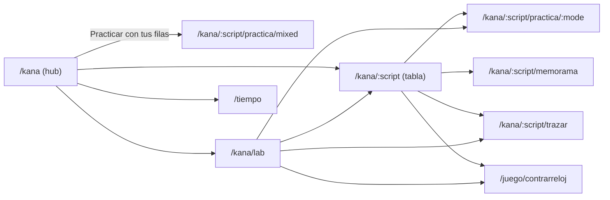

# Kana (`/kana`)

Hub de los dos silabarios. Enseña cuánto hiragana y katakana tienes dominado, deja volver a practicar las filas que elegiste la última vez y enlaza a la tabla de cada silabario, al laboratorio de katakana y a la pantalla de números y tiempo. Las tablas de kana, los trucos y los parecidos están en [kana.utils.ts](../../../src/app/utils/kana.utils.ts) ([su doc](../../utils/kana.utils.md)).

## Introducción

### Piezas

| Archivo | Qué hace |
|---|---|
| [kana.component.ts](../../../src/app/views/kana/kana.component.ts) | Hub: progreso por silabario (`mastery`) y filas guardadas (`saved`) |
| [kana.component.html](../../../src/app/views/kana/kana.component.html) | Cabecera con Musubi, tarjetas de hiragana y katakana, enlaces y consejos |
| [kana.component.scss](../../../src/app/views/kana/kana.component.scss) | Estilos del hub |
| [kana.utils.ts](../../../src/app/utils/kana.utils.ts) | Tablas de kana (`KANA_ROWS`, `allKana`) ([su doc](../../utils/kana.utils.md)) |
| [progress.service.ts](../../../src/app/services/progress.service.ts) | `mastery()` y `MASTERED_BOX` |
| [storage.utils.ts](../../../src/app/utils/storage.utils.ts) | `loadRaw` para leer las filas guardadas por la tabla |

### Pantallas de la vista

Todas las rutas están en [app.routes.ts](../../../src/app/app.routes.ts) y cargan su componente con `loadComponent`. Los parámetros (`:script`, `:mode`) y los query params (`rows`, `kana`) llegan como `input()` gracias a `withComponentInputBinding`.

| Ruta | Pantalla | Doc |
|---|---|---|
| `/kana` | Este hub | — |
| `/kana/lab` | Laboratorio de katakana | [katakana-lab.md](katakana-lab.md) |
| `/kana/:script` | Tabla de hiragana o katakana | [kana-chart.md](kana-chart.md) |
| `/kana/:script/practica/:mode?rows=…` | Quiz de kana | [kana-practice.md](kana-practice.md) |
| `/kana/:script/memorama?rows=…` | Memorama kana ↔ romaji | [kana-match.md](kana-match.md) |
| `/kana/:script/trazar?rows=…` | Trazar con el dedo | [kana-trace.md](kana-trace.md) |
| `/tiempo` | Números, fechas y tiempo (vista aparte, enlazada desde aquí) | [time.md](../time/time.md) |

- `/kana/lab` va **antes** que `/kana/:script` en las rutas: si no, `lab` se tomaría como un `script`.
- Práctica, memorama y trazar llevan `data: immersive`: la barra de pestañas se oculta.
- `rows` es la lista de ids de fila separados por comas (`a,k,s`). La pone la tabla y la leen las tres pantallas de práctica y el contrarreloj (`/juego/contrarreloj?kana=…&rows=…`).

### Qué hace el usuario

- **Tarjeta de hiragana o katakana**: abre la tabla (`/kana/hiragana` o `/kana/katakana`). Muestra una barra con los símbolos dominados sobre el total.
- **Practicar** (debajo de la tarjeta, solo si hay filas guardadas): abre el quiz mixto con esas filas. La línea dice «Tus filas: あ か さ … · 15 símbolos».
  - Sin filas guardadas para ese silabario, la línea no sale.
- **Laboratorio de katakana**: abre `/kana/lab`.
- **Números, fechas y tiempo**: abre `/tiempo`.
- **Cómo aprender kana**: cinco consejos fijos, sin interacción.

### Reglas

- **Dominado** = caja de Leitner ≥ `MASTERED_BOX` (**4**) en la clave `k:<carácter>`.
- El total cuenta **básicos, tenten y combinados**; los extranjeros (`group === 'extended'`, solo katakana) se excluyen porque son opcionales. Por eso katakana y hiragana tienen el mismo total.
- «Tus filas» enseña la primera letra de las primeras **6** filas (`MAX_SAVED_HEADS`) y añade `…` si hay más.

### Datos guardados

- Lee `nihongo:mastery` a través de `ProgressService.mastery()`.
- Lee `nihongo:kanaRows:hiragana` y `nihongo:kanaRows:katakana` con `loadRaw` (las escribe la [tabla](kana-chart.md#datos-guardados)). No escribe nada.

---

## Recorrido del código paso a paso

Todo está en [kana.component.ts](../../../src/app/views/kana/kana.component.ts); los nombres son buscables.

### 1. Arranque

1. La ruta `/kana` carga `KanaComponent` (selector `app-kana-hub`).
2. No hay `constructor` ni ciclo de vida: la vista son dos `computed` y una lista fija.
3. **`scripts`**: las dos tarjetas (`id`, nombre, nombre en japonés, glifo grande y descripción). La plantilla las recorre con `@for`.

### 2. Progreso por silabario

**`mastery`** lee `progressSVC.mastery()` y, para cada silabario:

1. `allKana(script)` sin filtro de filas → todos los kana de la tabla, sin celdas vacías.
2. Quita los de grupo `extended`.
3. Cuenta los que tienen `box >= MASTERED_BOX` (una clave que no existe cuenta como `-1`).
4. Devuelve `{ done, total, pct }`. La plantilla usa `pct` como ancho de la barra y `done/total` como texto.

### 3. Filas guardadas

**`saved`**:

1. Lee `progressSVC.mastery()` **solo como disparador**: cuando vuelves de una práctica, la maestría ha cambiado y el `computed` se recalcula y relee las filas (que viven en `localStorage`, no en un signal).
2. Para cada silabario, `loadRaw('kanaRows:<script>', [])`.
3. Filtra `KANA_ROWS[script]` por esos ids. Sin ninguna, devuelve `null` (la plantilla no pinta la línea).
4. `count` = celdas no vacías de esas filas. `heads` = primer carácter de las primeras `MAX_SAVED_HEADS` filas.
5. Devuelve `{ rows, count, heads }`; `rows` vuelve a ser la lista separada por comas para el query param.

El botón **Practicar** navega con `routerLink` a `['/kana', script.id, 'practica', 'mixed']` y `queryParams: { rows }`.

### 4. Salida

Nada que limpiar: no hay timers, suscripciones ni audio.

### Estilos

[kana.component.scss](../../../src/app/views/kana/kana.component.scss), por secciones: cabecera, tarjetas de silabario (`.gl` cambia de color con `data-s='katakana'`), filas guardadas (`.last`, `.go`), enlaces (`.ic` cambia de color con `data-c='gold'`) y consejos.
